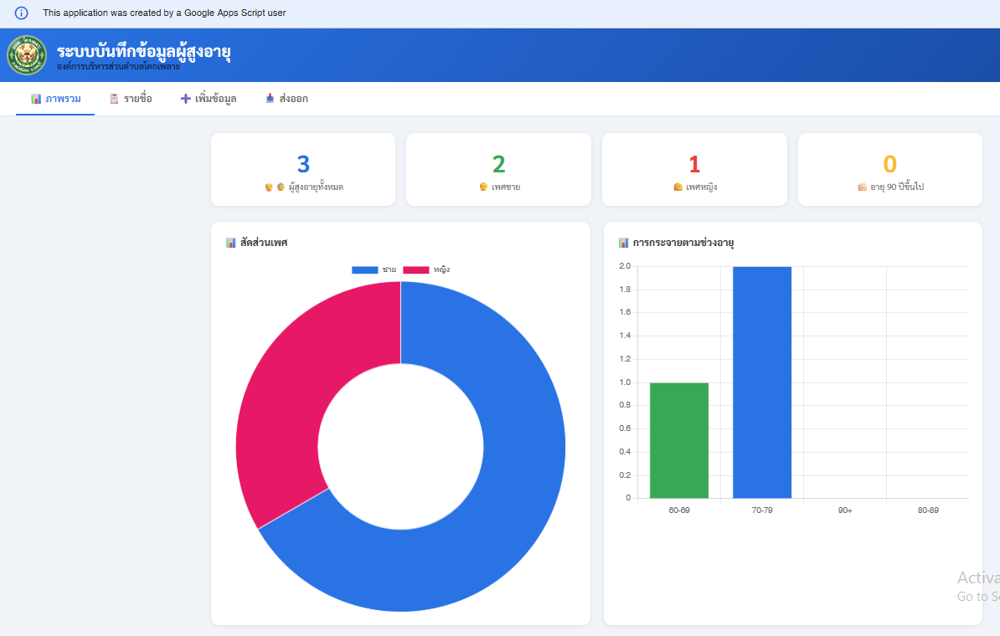
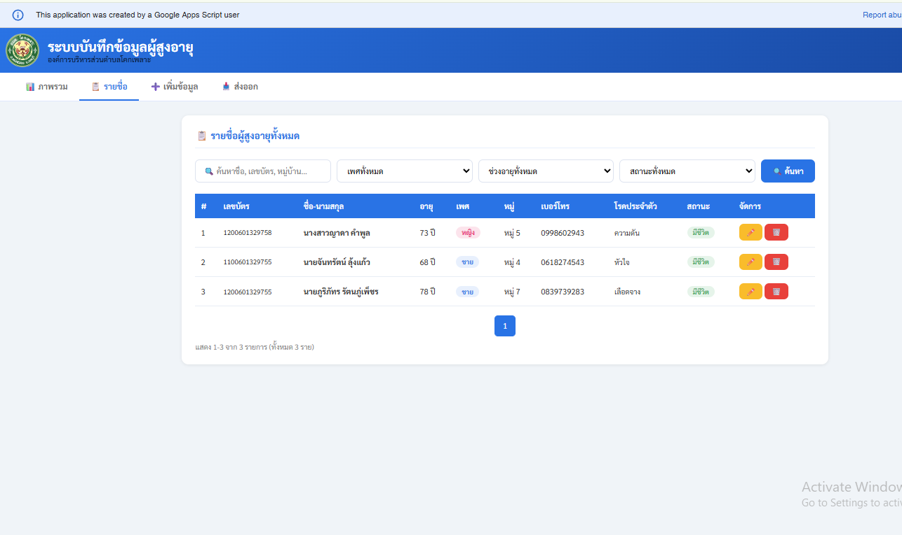
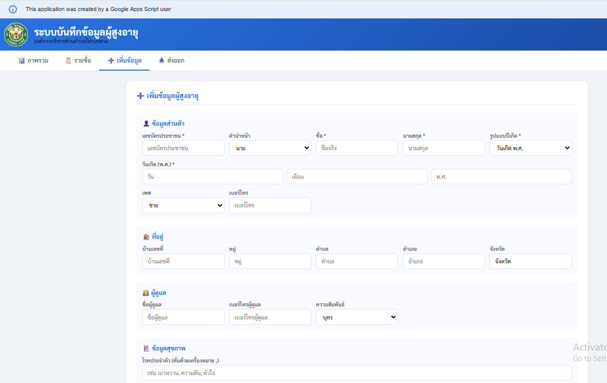
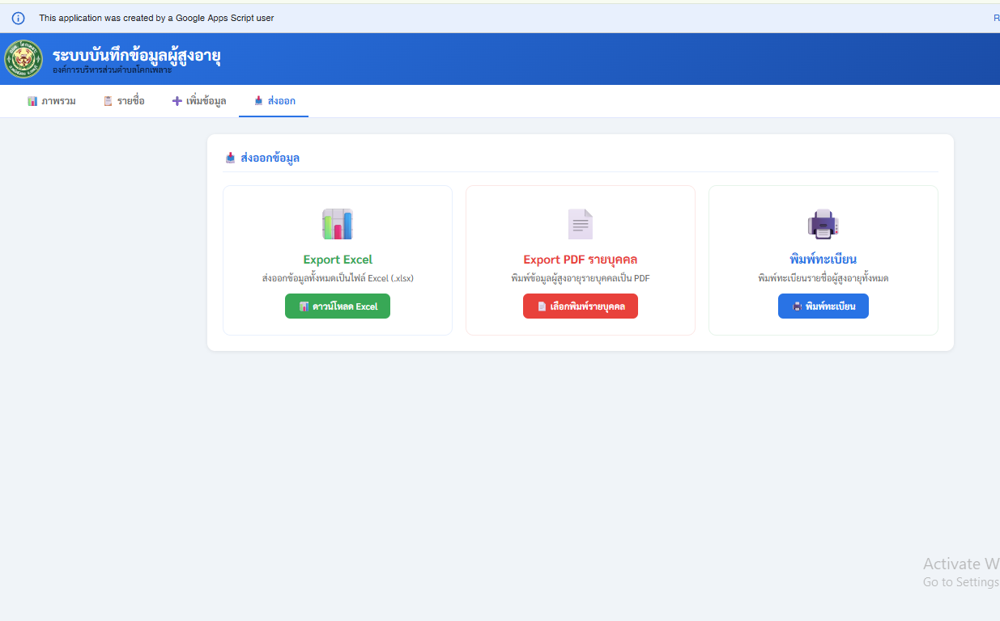

# Elderly Data Management System

## Overview
Internal data management system developed for local administrative operations using Google Apps Script and Google Sheets.

The system helps manage elderly citizen records, generate reports, and reduce manual document processing.

---

## Features

- Data entry system
- Dashboard for data monitoring
- PDF export
- Excel export
- Google Sheets integration

---

## Technologies Used

- Google Apps Script
- Google Sheets
- JavaScript
- Spreadsheet Automation

---

## Problems Solved

- Reduced manual paperwork
- Improved data organization
- Simplified report generation workflow
- Faster document export process

---

## My Responsibilities

- Designed data workflow
- Developed automation scripts
- Built dashboard and form system
- Implemented PDF and Excel export
- Maintained and improved system usability

---

## Notes

This project was developed as an internal operational tool for administrative support purposes.

## Screenshots

### Dashboard

### Data List Of Name

### Data Entry Form

### Export Feature

